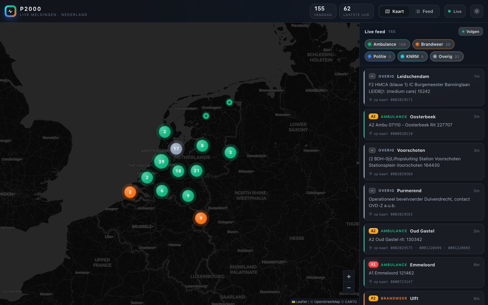

# radio

A live map of Dutch emergency-services pager traffic, pulled out of the air with a €30 USB
dongle. Runs at **[p2000.typeguru.nl](https://p2000.typeguru.nl)**.



P2000 is the unencrypted FLEX paging network the Dutch fire brigade, ambulance services,
police and KNRM get dispatched over. It sits on 169.65 MHz and anyone with a cheap RTL-SDR
can listen. This decodes it, figures out *what* and *where* each call is, and drops it on a
map as it happens.

## How it's wired

Two halves, because the box with the antenna doesn't want to be a web server and the web
server doesn't want an antenna:

```
 RTL-SDR dongle
     │   rtl_fm | multimon-ng          FM demod + FLEX decode
     ▼
 receiver-agent (Zig)                  parse each line, POST it as JSON
     │
     ▼   https://…/ingest
 backend (justscale / Node + Postgres) priority + discipline + geocode,
     │                                  store, live SSE feed, serve the page
     ▼
 browser                               Leaflet map + live feed
```

The one thing worth knowing about SDR: a dongle can only hear ~2.4 MHz of spectrum at a time,
so this one does P2000 and nothing else. If you want aircraft or ships too, that's another
dongle — though a single wideband antenna can feed all of them.

## What's in here

- **`agent/`** — a small Zig program that babysits the `rtl_fm | multimon-ng` pipeline
  (restarting it when the USB stick throws a tantrum), parses the FLEX lines, and POSTs them to
  the backend. Cross-compiles to a static musl binary and ships in a ~9 MB container, so it's
  happy on a NAS with the dongle passed through. Config is all env vars — `P2000_FREQ` /
  `P2000_GAIN` / `P2000_PPM`, `P2000_LOG` to also tee messages to a file, `P2000_INGEST_URL` +
  `P2000_INGEST_SECRET` for where to send them, and `P2000_CMD` to feed it canned input instead
  of a radio (handy for tests).
- **`backend/`** — the server, built on [justscale](https://github.com/justscale/justscale).
  Accepts messages on `/ingest`, enriches them, stores them in Postgres, and exposes a REST
  history (`/api/messages`) plus a live SSE stream (`/events`). Also serves the frontend.
- **`frontend/`** — the map. A single self-contained page (Leaflet + vanilla JS, no build step)
  the backend serves at `/`.
- **`deploy/`** — the Kubernetes manifests. ArgoCD watches this folder.

The JSON shape the agent and backend agree on is written down in [`docs/WIRE.md`](docs/WIRE.md).

## Making sense of the messages

The raw text is terse and never quite consistent — `A2 Ambu 07110 - Oosterbeek Rit 227707`,
`P 1 BR wegvervoer (bestelbus) … Denekamp`. The backend teases out three things:

- **Priority.** `A1/A2/B1/B2` is the ambulance urgency scheme; `P 1` / `PRIO 2` is fire and police.
- **Discipline.** Ambulance, brandweer, politie or KNRM, guessed from keywords in the body.
- **Where.** The address is cleaned up and handed to [PDOK's Locatieserver](https://www.pdok.nl/)
  (the official Dutch geocoder), which lands a hit roughly 90% of the time. Those become the pins;
  the rest still show up in the feed, just without a dot on the map.

Mapping capcodes to specific units is the obvious next step and isn't done yet.

## Privacy

Receiving P2000 is legal and the traffic is public, but the messages can carry the name and
address of someone having the worst day of their life. Keep it operational — don't build a
searchable history of individuals out of it. Raw captures are gitignored on purpose; don't
commit them.

## Running it locally

Needs Node 24 + pnpm for the backend, and Zig 0.16 + an RTL-SDR for the radio half.

```sh
pnpm install

# backend against a throwaway postgres
docker run -d --name p2000-pg -e POSTGRES_PASSWORD=dev -e POSTGRES_DB=p2000 -p 5433:5432 postgres:16
pnpm --filter @radio/backend dev          # serves on :3000

# no dongle handy? replay captured messages into it
node scripts/replay-captures.mjs path/to/capture.jsonl
```

The agent:

```sh
cd agent
pnpm test                                 # FLEX parser unit tests (zig test)
zig build-exe src/main.zig -lc -femit-bin=agent && ./agent   # native, needs the dongle
./build.sh amd64                          # static musl binary for the container
```

## Deployment

The backend image is built by GitHub Actions and pushed to `ghcr.io/jaenster/p2000`. It runs
on a small Hetzner k3s cluster; ArgoCD syncs `deploy/` straight from this repo. Postgres is
CloudNativePG, TLS is cert-manager + Let's Encrypt. No secrets live in the repo — the database
URL and the ingest secret are created out of band.

## Standing on shoulders

[multimon-ng](https://github.com/EliasOenal/multimon-ng) does the actual FLEX decoding,
[rtl-sdr](https://osmocom.org/projects/rtl-sdr) drives the radio, PDOK does the geocoding, and
CARTO's dark basemap makes it look the part.

## License

MIT.
